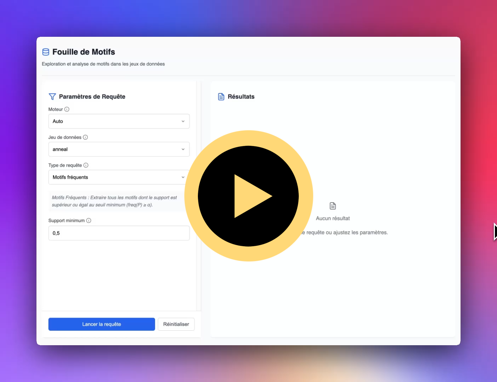

# Project CGKS: Declarative & Specialized Itemset Mining

This project is a full-stack application for itemset mining, featuring:

- A Java backend (Spring Boot, Maven)
- A Python model (training and classifier API)
- A React frontend
- Swagger UI documentation

## Demo

<div align="center">
  <a href="https://youtu.be/BrGsEx2E1rg">
    
  </a>
</div>

## Table of Contents

- [Project CGKS: Declarative \& Specialized Itemset Mining](#project-cgks-declarative--specialized-itemset-mining)
  - [Demo](#demo)
  - [Table of Contents](#table-of-contents)
  - [Prerequisites](#prerequisites)
  - [Project Structure](#project-structure)
  - [Quick Start](#quick-start)
    - [1. Clone the repository](#1-clone-the-repository)
    - [2. Set up and build the project](#2-set-up-and-build-the-project)
    - [3. Run the project](#3-run-the-project)
      - [1. Train the Python model (optional)](#1-train-the-python-model-optional)
      - [2. Run the backend (Spring Boot)](#2-run-the-backend-spring-boot)
      - [3. Run the Python classifier API](#3-run-the-python-classifier-api)
      - [4. Serve the React frontend](#4-serve-the-react-frontend)
      - [5. Serve the Swagger UI documentation](#5-serve-the-swagger-ui-documentation)
  - [Additional Commands](#additional-commands)

## Prerequisites

- **Python 3.8+** (for model training and classifier API)
- **Node.js 16+ & npm** (for frontend)
- **Java 11+** (for backend)
- **Maven** (for backend build)
- **Make** (to use provided Makefile)

Ensure all prerequisites are installed and available in your PATH.
If you encounter issues with permissions or missing dependencies, check your environment and install any missing tools.

## Project Structure

📂 **Root Directory**

- 📄 [`Makefile`](./Makefile) - Build automation
- 📄 [`requirements.txt`](./requirements.txt) - Python dependencies
- 📄 [`pom.xml`](./pom.xml) - Maven configuration
- 📂 [`study/`](./study/) - Python model code
- 📂 [`src/`](./src/)
  - 📂 [`main/`](./src/main/)
    - 📂 [`java/`](./src/main/java/) - Java backend code
    - 📂 [`python/`](./src/main/python/) - Python classifier API
    - 📂 [`resources/`](./src/main/resources/) - Datasets and Python model `.pkl` file
  - 📂 [`test/`](./src/test/)
    - 📂 [`java/`](./src/test/java/) - Java test classes
- 📂 [`frontend/`](./frontend/)
  - 📂 [`motif-mining-app/`](./frontend/motif-mining-app/) - React frontend
- 📂 [`frontend-docs/`](./frontend-docs/)
  - 📂 [`swagger-ui/`](./frontend-docs/swagger-ui/) - Swagger UI documentation

## Quick Start

### 1. Clone the repository

```bash
git clone https://github.com/mathusanm6/Project-CGKS.git
cd Project-CGKS
```

### 2. Set up and build the project

```bash
# Ensure you are in the root directory of the project
make prep
```

This will:

- Create a Python virtual environment and install requirements
- Resolve Java dependencies and build the backend
- Build the React frontend

### 3. Run the project

<div align="center">
  <a href="https://www.youtube.com/watch?v=Yw1i555thiQ">
    
  </a>
</div>

#### 1. Train the Python model (optional)

```
# In the Python virtual environment
make model
```

This runs the training script and copies the trained model to the backend resources. Since the trained model is already provided, you don't have to do it.

#### 2. Run the backend (Spring Boot)

```bash
# Ensure you are in the root directory of the project
make api
```

The backend will start on the default port (8080).

#### 3. Run the Python classifier API

```bash
# Ensure you are in the root directory of the project
make selector
```

```bash
# Ensure you are in the root directory of the project
make selector
```

This starts the Python API for classification. It will run on port 3001 by default.

#### 4. Serve the React frontend

```bash
# Ensure you are in the root directory of the project
make ui
```

The frontend will be available at http://localhost:3000.

#### 5. Serve the Swagger UI documentation

```bash
# Ensure you are in the root directory of the project
make docs
```

```bash
# Ensure you are in the root directory of the project
make docs
```

The docs will be available at http://localhost:8000.

## Additional Commands

- `make test` — Run Java unit tests
- `make clean` — Clean Java build artifacts

## Contributors

| First Name | Last Name  | GitHub ID       |
| ---------- | ---------- | --------------- |
| Jewin      | CHENG      | @jewinc         |
| Tiphaine   | GAYET      | @tiphaine-gayet |
| Aleksandra | KOVIAZINA  | @KoviazinaA     |
| Mathusan   | SELVAKUMAR | @mathusanm6     |

